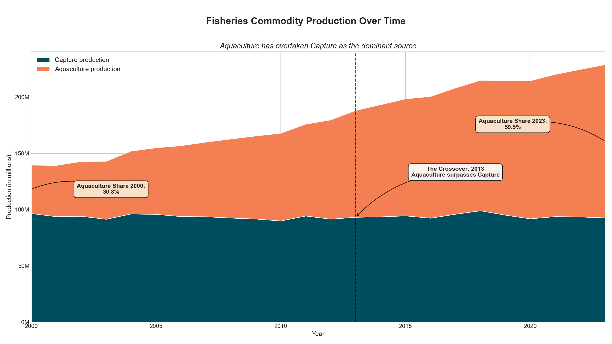
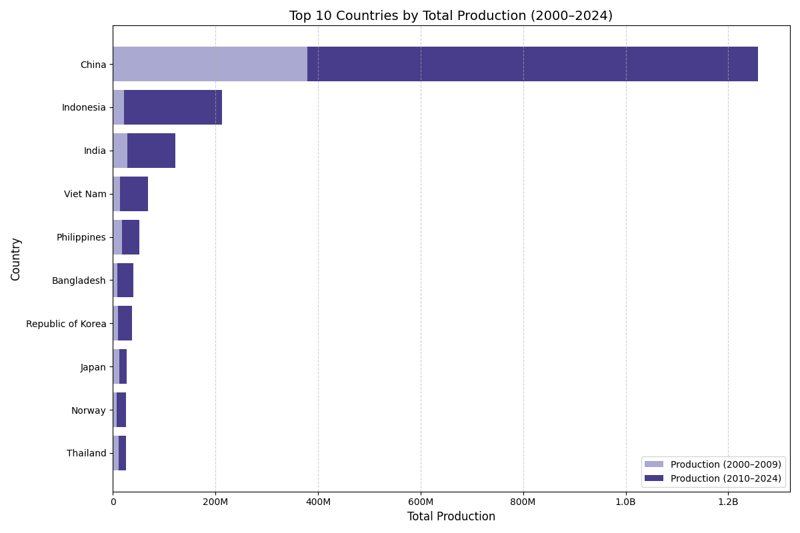
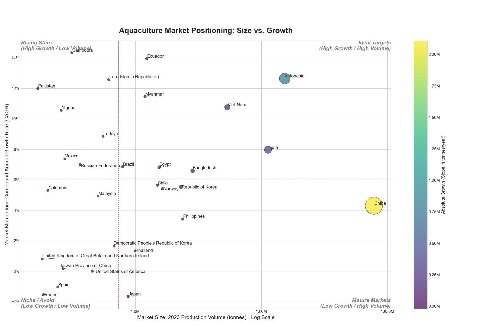
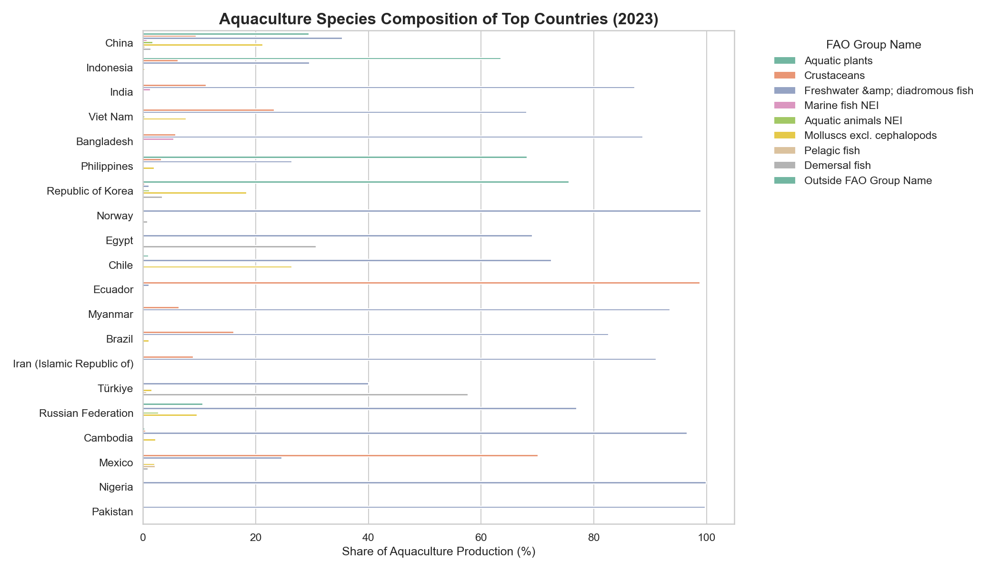

# 🌊 Aquaculture Market Analysis: Identifying High-Potential Countries for Expansion

### *Still a draft

## 📖 Introduction
This project analyzes global aquaculture production data to uncover trends, top species, and countries with high potential for market expansion. 

Assumed business case: You're a data analyst at a company that sells aquaculture tools and want to identify **country tha can became an option** to expand into, based on **volume, growth rate, and species trends**.

## 📂 Dataset Description
- Source: [FAO Fishery Statistics](https://www.fao.org/fishery/statistics-query/en/global_production/global_production_quantity)
- Years: 2000–2024
- Fields: Country, Species, Year, Source (Capture/Aquaculture), Production (tons/number)

## 🧼 Data Cleaning Summary
- Edited the name of the column
- Edited the source as Aquaculture and Capture
- Aggregated by country/FAO Group/year
- Handled missing values and zeros

this is how my df head look like after cleaning
|       | Country       | Source                 | CPC Group Name                                    | Continent   | FAO Group Name                   | Unit                 |   Year |   Production |
|------:|:--------------|:-----------------------|:--------------------------------------------------|:------------|:---------------------------------|:---------------------|-------:|-------------:|
| 30763 | Albania       | Aquaculture production | Crustaceans, live, fresh or chilled               | Europe      | Crustaceans                      | Tonnes - live weight |   2008 |          7   |
| 19661 | Portugal      | Capture production     | Fish live, fresh or chilled for human consumption | Europe      | Marine fish NEI                  | Tonnes - live weight |   2014 |        407   |
| 47612 | Ethiopia      | Capture production     | nan                                               | Africa      | nan                              | Number               |   2000 |         44   |
| 43047 | Albania       | Capture production     | Fish live, fresh or chilled for human consumption | Europe      | Pelagic fish                     | Tonnes - live weight |   2002 |        244   |
| 26929 | China         | Aquaculture production | Fish live, fresh or chilled for human consumption | Asia        | Pelagic fish                     | Tonnes - live weight |   2010 |     131573   |
|  3545 | Spain         | Aquaculture production | Fish live, fresh or chilled for human consumption | Europe      | Freshwater &amp; diadromous fish | Tonnes - live weight |   2022 |      16877.6 |
| 37705 | Guinea-Bissau | Capture production     | Fish live, fresh or chilled for human consumption | Africa      | Marine fish NEI                  | Tonnes - live weight |   2005 |       3062   |
| 32222 | Portugal      | Aquaculture production | Fish live, fresh or chilled for human consumption | Europe      | Freshwater &amp; diadromous fish | Tonnes - live weight |   2008 |        305   |
| 29900 | Mozambique    | Aquaculture production | Fish live, fresh or chilled for human consumption | Africa      | Freshwater &amp; diadromous fish | Tonnes - live weight |   2009 |        116   |
| 45450 | Croatia       | Capture production     | Molluscs live, fresh or chilled                   | Europe      | Molluscs excl. cephalopods       | Tonnes - live weight |   2001 |        125   |'

## 📊 Exploratory Data Analysis (EDA)
Core questions to be ask:
- What is the trend of fisheries production globally, especially in aquaculture? is it worth growing and worth to be invested?
- Which countries are the most significant producers in the global aquaculture market?
- Which countries represent the greatest growth opportunity, not just the large current market?
- For the most promising countries, what is the composition of their aquaculture industry?

### Phase 1 Analysis: Global Production Trends in Fisheries
#### 📈 What is the trend of fisheries production globally, especially in aquaculture? is it worth growing and worth to be invested?

Answering the fundamental question of market viability, the global fisheries industry shows a clear and sustained growth trajectory from 2000 to the present. The total combined production from both capture fisheries and aquaculture has consistently increased over the last two decades. However, this overall growth masks a critical internal shift. A closer look reveals that this expansion is driven almost exclusively by one sector: aquaculture.
While traditional capture fisheries production has remained largely stagnant, hovering around a stable level since 2000, aquaculture production has experienced explosive and continuous growth. This dramatic divergence in trends led to a pivotal moment in 2013, "The Crossover" year, when aquaculture production surpassed capture production for the first time. This shift has only accelerated since. In the year 2000, aquaculture accounted for just 30.8% of the total fisheries commodity production. By 2023, its contribution had nearly doubled, commanding a dominant 59.5% share. This data unequivocally demonstrates that aquaculture is not only a growing industry but is now the primary engine of growth for the entire global fisheries sector, validating it as a compelling area for investment.

### Phase 2 Analysis: Identifying the Titans of Aquaculture
#### Which countries are the most significant producers in the global aquaculture market?

To identify viable investment markets, we must first recognize the dominant players and their consistency over time. The data on total aquaculture production from 2000-2024 reveals a landscape dominated by a few key nations, who have established themselves as consistent powerhouses.
The current market leaders, representing the top 10 countries by production volume, are unequivocally led by China, whose output dwarfs all other nations. Following China, a second tier of major producers includes Indonesia, India, and Viet Nam. The list of consistent top performers is rounded out by the Philippines, Bangladesh, Republic of Korea, Japan, Norway, and Thailand.
These ten nations are not just recent leaders; they are consistent powerhouses. The chart clearly shows that every country in the top 10 has maintained significant production levels over the last decade. The substantial volume contributed during the 2010-2024 period (dark purple bars) confirms their enduring status as the industry's most reliable and significant producers. This consistency, especially the accelerated growth in the more recent decade, points to stable, well-established markets with robust infrastructure and sustained demand, making them the primary focus for any strategic investment analysis.

### Phase 3 Analysis: Spotting the Rising Stars and Ideal Targets
#### Which countries represent the greatest growth opportunity, not just the large current market?

While sheer production volume identifies the current titans, a forward-looking investment strategy must prioritize growth. To uncover the most dynamic markets, we analyze both market size and momentum, measured by the Compound Annual Growth Rate (CAGR). This reveals a crucial distinction between established leaders and the opportunities of tomorrow.
The market positioning chart clearly segments countries into four strategic categories:
Ideal Targets (High Growth / High Volume): This is the most attractive quadrant for investment. Indonesia is the standout performer here, combining a massive production volume with an exceptional CAGR of over 12%. India and Viet Nam also fall into this category, demonstrating both significant scale and strong growth momentum. These countries represent the best of both worlds: established demand and rapid expansion.
Rising Stars (High Growth / Low Volume): These countries have the highest growth rates and represent significant future potential. Nations like Ecuador, Iran, Pakistan, and Nigeria are posting impressive CAGRs, indicating they are rapidly scaling their aquaculture industries. While their current market size is smaller, their high momentum makes them key markets to watch for future dominance.
Mature Markets (Low Growth / High Volume): This quadrant highlights the importance of looking beyond size alone. China, the world's largest producer, has a CAGR near zero, classifying it as a mature and saturating market. Other large producers from Phase 2, such as the Philippines and Japan, also show low or even negative growth, indicating limited expansion potential.
In conclusion, comparing the top producers by volume against their growth rates reveals a critical insight: the biggest markets are not always the best for future investment. While China remains the largest, the most compelling opportunities lie with the "Ideal Targets" like Indonesia, which offer scale and explosive growth, and the "Rising Stars" like Ecuador, which promise to be the next generation of market leaders.

### Phase 4 Analysis: The Deep Dive into Species Composition
#### For the most promising countries, what is the composition of their aquaculture industry?

Having identified the most promising markets based on size and growth, the final step is to analyze their internal composition to ensure product-market fit. The equipment and technology needs for aquaculture vary drastically by species. This analysis reveals critical differences between our target countries.
The species breakdown for our shortlisted high-growth countries highlights two distinct market types:
Hyper-Specialized Markets: Several high-growth nations are overwhelmingly dominated by a single species group. Ecuador, a top "Rising Star," is the most extreme example, with nearly 100% of its massive production concentrated in one type of aquaculture. Similarly, "Ideal Target" India and "Rising Stars" Bangladesh and Egypt show that over 70-80% of their industries are focused on one primary species group. For a company whose products are tailored to these specific species (e.g., crustacean farming in Ecuador, or finfish pond systems in Egypt and India), these countries represent a highly concentrated and lucrative opportunity.
Diversified Markets: In stark contrast, other "Ideal Targets" like Indonesia and Viet Nam exhibit a much more diversified production portfolio. Neither country has a single species group that accounts for more than 50% of its total output. Instead, they cultivate a mix of finfish, crustaceans, and other species. These markets are ideal for companies with a broader range of products, as they offer multiple entry points and opportunities to cross-sell different technologies.
This deep dive is crucial: while Ecuador and Indonesia are both top-tier growth markets, their internal structures are fundamentally different. A successful market entry strategy depends entirely on aligning a company's specific product line with the dominant farming practices of the target country.

### Phase 4.2 Analysis: Uncovering Sector-Specific Trends in Countries That Promising
#### Within a single target country, are they diversifying their farmed species or concentrating on just a few? Is the production of a high-value species growing faster than lower-value species?(Example Country : Indonesia, Example High Value Group : Crustacean)

A granular analysis of Indonesia, our prime "Ideal Target" market, reveals critical internal trends that are essential for shaping a successful entry strategy. While Indonesia's overall aquaculture growth is impressive, this growth is not evenly distributed across species groups; rather, it is highly concentrated in a few key areas.
The market is overwhelmingly driven by the explosive growth of aquatic plants (primarily seaweed), which has skyrocketed since 2005 to become the dominant production category by a vast margin. The second major driver is freshwater & diadromous fish, which has also seen strong, sustained growth.
Crucially, when we examine the trend for high-value species, a nuanced picture emerges. The production of Crustaceans (High Value), such as shrimp, shows consistent and healthy growth, reaching a substantial volume of nearly one million tonnes in 2023. However, this growth is vastly outpaced by the sheer scale and velocity of the lower-value commodity groups.
This presents a compelling dual opportunity in the Indonesian market. While the massive volume in aquatic plants and freshwater fish offers a large-scale market for foundational aquaculture technologies, the steady and significant growth of the high-value crustacean sector provides a lucrative, specialized niche for more advanced, high-margin products. This unique combination of scale and value confirms Indonesia's status as a top-tier market with multiple avenues for entry and expansion.

### Phase 5 Analysis: Market Recommendations
#### Which countries offer the best opportunities for expansion, based on our analysis?

Bringing together our insights on production volume, growth rates, species composition, and high-value sector trends, we recommend the following strategy for market expansion:

---

#### 🚀 **Ideal Targets**
These countries offer the strongest combination of scale, growth, and high-value species, making them the best options for immediate expansion:
- **Indonesia**: Massive production volume, diversified species portfolio, strong crustacean sector, and high CAGR.
- **India**: Large-scale producer, major crustacean output, excellent growth.
- **Viet Nam**: Balanced production mix, solid crustacean production, high momentum.
- **Ecuador**: Focused on crustaceans, very high growth — an ideal niche opportunity.

---

#### 🌟 **Rising Star Markets**
Smaller markets with rapid growth that could become major players:
- **Iran (Islamic Republic of)**: Freshwater & crustaceans, good growth.
- **Türkiye**: Diversified species, steady upward trend.
- **Mexico**: Crustacean growth, emerging potential.
- **Nigeria**: Strong freshwater production growth.
- **Cambodia**: High CAGR, small but dynamic.
- **Pakistan**: Growing, mainly freshwater and crustaceans.

---

#### 🏁 **Mature Markets**
Large but low-growth markets — attractive only for specialized, competitive or premium product offerings:
- **China**
- **Norway**
- **Republic of Korea**
- **Philippines**
- **Chile**

---

#### 🎯 **Summary Recommendation**
Prioritize immediate entry strategies for **Indonesia**, **India**, **Viet Nam**, and **Ecuador** — these markets offer both volume and growth, with strong high-value segments.  
Consider pilot programs or partnerships in the **Rising Star** countries to establish presence early in their growth curve.

---

#### 🚀 **Next Steps**
- Develop detailed country-specific market entry plans
- Identify local partners/distributors
- Assess regulatory frameworks and trade barriers
- Explore product-market fit per dominant species group in each country

## 🙋‍♂️ About Me
I'm Fadil M Nasrudy, a data analyst transitioning from fisheries science into data analytics. This project shows my ability to combine domain expertise with analytical thinking and present actionable insights for business decisions.

