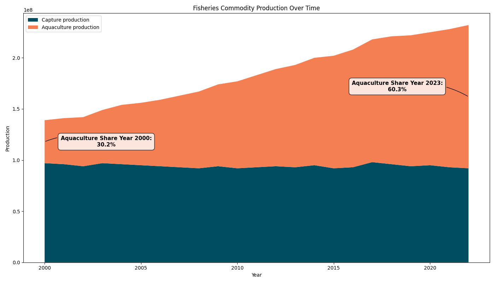

# 🌊 Aquaculture Market Analysis: Identifying High-Potential Countries for Expansion

### *Still a draft

## 📖 Introduction
This project analyzes global aquaculture production data to uncover trends, top species, and countries with high potential for market expansion. 

Assumed business case: You're a data analyst at a company that sells aquaculture tools and want to identify **top 5 target countries** to expand into, based on **volume, growth rate, and species trends**.

## 📂 Dataset Description
- Source: [FAO Fishery Statistics](https://www.fao.org/fishery/statistics-query/en/global_production/global_production_quantity)
- Years: 2000–2024
- Fields: Country, Species, Year, Source (Capture/Aquaculture), Production (tons/number)

## 🧼 Data Cleaning Summary
- Edited the name of the column
- Edited the source as Aquaculture and Capture
- Exclude the unit that recorded as number
- Aggregated by country/species/year
- Handled missing values and zeros

this is how my df head look like after cleaning

|        | Country   | Species           | Unit                 | Source             |   Year |   Production |
|-------:|:----------|:------------------|:---------------------|:-------------------|:-------:|-------------:|
| 163730 | Guam      | Rainbow runner    | Tonnes - live weight | Capture production |   2014 |         0.86 |
| 283512 | Italy     | Picarels NEI      | Tonnes - live weight | Capture production |   2007 |      1644    |
| 142595 | Canada    | Lake trout(=Char) | Tonnes - live weight | Capture production |   2015 |       501    |
|  44900 | Panama    | Whiteleg shrimp   | Tonnes - live weight | Aquaculture        |   2021 |      5195    |
|  80769 | Portugal  | Lings NEI         | Tonnes - live weight | Capture production |   2019 |        11    |

## 📊 Exploratory Data Analysis (EDA)
Core questions to be ask:
- What is the trend of fisheries production globally, especially in aquaculture? is it worth growing and worth to be invested?
- Which countries are the most significant producers in the global aquaculture market?
- Which countries represent the greatest growth opportunity, not just the large current market?
- For the most promising countries, what is the composition of their aquaculture industry?

## 🔬 Trend Analysis & Country Ranking
- Used linear regression to calculate production growth rate (2010–2024)
- Combined total production + growth with a weighting system
- Selected 5 high-potential countries based on:
   - High production volume
   - Positive growth rate
   - Dominant aquaculture species

## 📈 Clustering & Segmentation
- PCA used to reduce dimensionality of country-species production matrix
- KMeans clustering revealed 4 groups of countries with similar species profiles
- Identified dominant species per cluster for marketing targeting

## 🧠 Final Business Insights
- Recommend expansion into: Indonesia, India, Bangladesh, Vietnam, Egypt
- Reasoning:
   - Strong production
   - High or consistent growth
   - Common species: Tilapia, Carp, Seaweed
- Each cluster can inform product strategy (e.g., tech intensity, pricing)

## 🚀 How to Run, fix this later
git clone https://github.com/yourusername/aquaculture-market-analysis.git
cd aquaculture-market-analysis
jupyter notebook

## 🙋‍♂️ About Me
I'm Fadil M Nasrudy, a data analyst transitioning from fisheries science into data analytics. This project shows my ability to combine domain expertise with analytical thinking and present actionable insights for business decisions.

