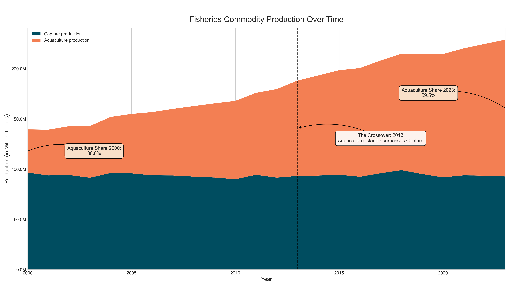
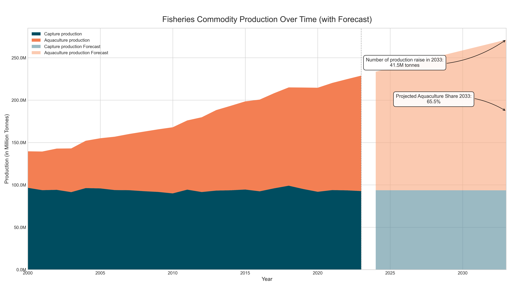
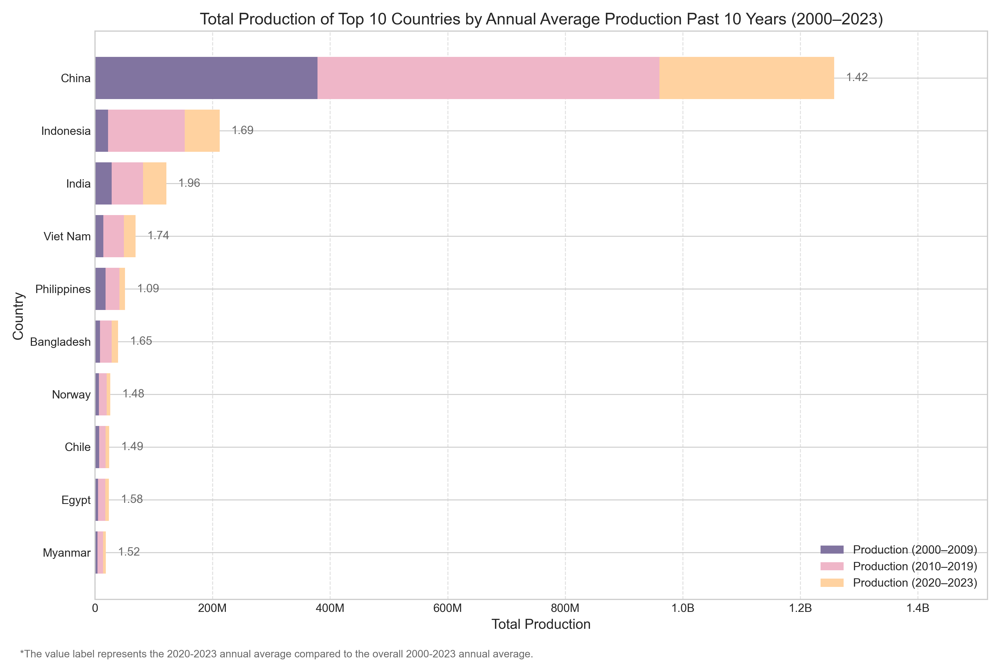
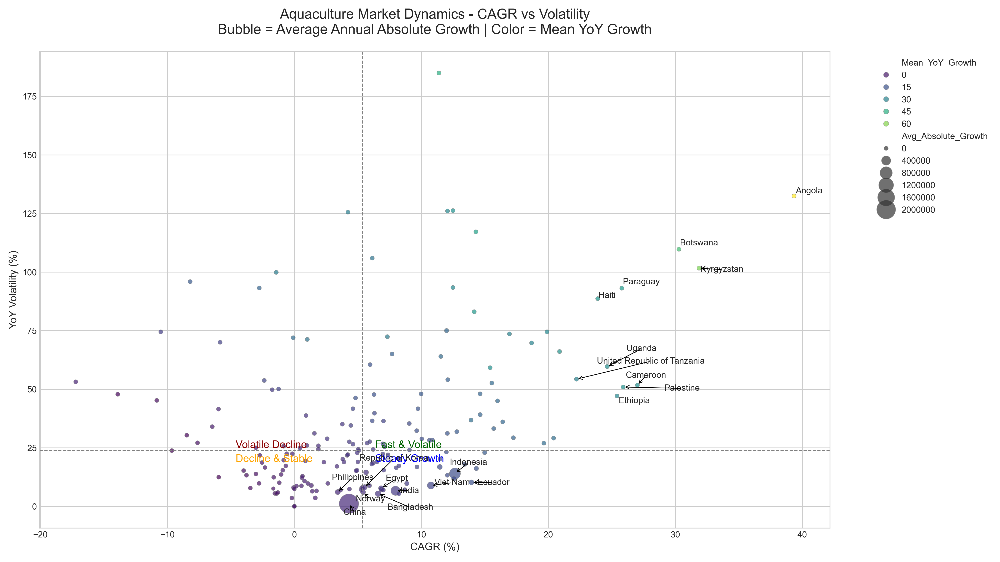
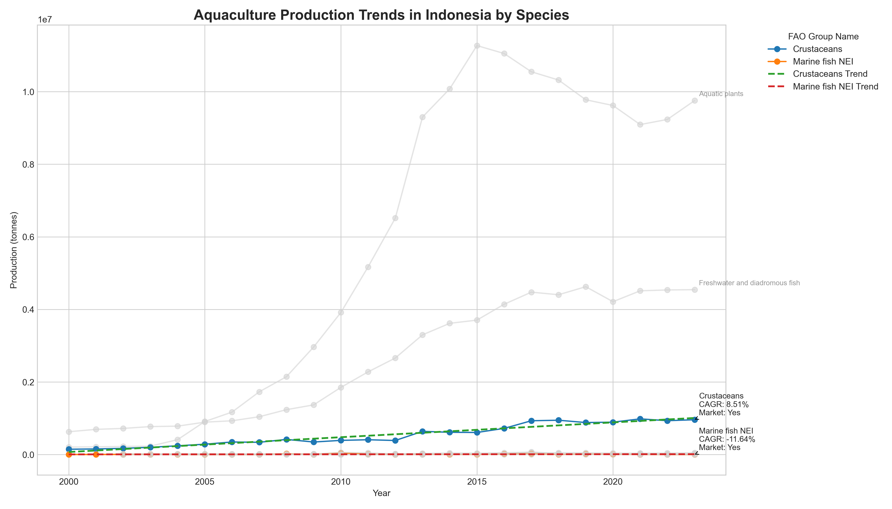

# 🌊 Aquaculture Market Analysis: Identifying High-Potential Countries for Expansion

## 📖 Introduction
This project analyzes global aquaculture production data to uncover trends, top species, and countries with high potential for market expansion.

**Business case**: You're a data analyst at a company that sells aquaculture tools. The goal is to identify **countries that could be ideal targets for expansion** based on production volume, growth rate, stability, and species composition.

## 📂 Dataset Description
- **Source**: [FAO Fishery Statistics](https://www.fao.org/fishery/statistics-query/en/global_production/global_production_quantity)
- **Years**: 2000–2024
- **Fields**: `Country`, `Species`, `Year`, `Source (Aquaculture/Capture)`, `Production (tons/number)`

## 🧼 Data Cleaning Summary
- Standardized column names and categories
- Ensured `Source` was consistently labeled as *Aquaculture* or *Capture*
- Aggregated production by country, species group, and year
- Handled missing values and cleaned zero values for CAGR analysis

## 📊 Exploratory Data Analysis (EDA)

Core questions to be ask:
- What is the trend of fisheries production globally, especially in aquaculture? is it worth growing and worth to be invested?
- Which countries are the most significant producers in the global aquaculture market?
- Which countries represent the greatest growth opportunity, not just the large current market?
- For the most promising countries, what is the composition of their aquaculture industry?

### Phase 1 Analysis: Global Production Trends in Fisheries
#### 📈 What is the trend of fisheries production globally, especially in aquaculture? is it worth growing and worth to be invested?

- Fisheries production has grown consistently since 2000.
- The growth is driven almost entirely by **aquaculture**.
- In 2013, aquaculture surpassed capture fisheries in production volume (“The Crossover”).

i also try to create a simple forecast. here's the result

### Phase 2 Analysis: Identifying the Titans of Aquaculture
#### Which countries are the most significant producers in the global aquaculture market?

- The **top 10 producers** include China, Indonesia, India, Viet Nam, Philippines, Bangladesh, Republic of Korea, Japan, Norway, and Thailand.
- These countries account for the bulk of global aquaculture output.

### Phase 3 Analysis: Spotting the Rising Stars and Ideal Targets
#### Which countries represent the greatest growth opportunity, not just the large current market?

- We calculated:
  - **CAGR (Compound Annual Growth Rate)** — identifies sustained growth.
  - **YoY Volatility** — highlights production stability.
  - **Absolute Annual Growth** — indicates real expansion in volume.
- Countries were positioned in quadrants: *Fast and Volatile*, *Slow and Volatile*, *Steady Growth*, and *Slow and Stable*.

### Phase 4 Analysis: The Deep Dive into Species Composition
#### For the most promising countries, what is the composition of their aquaculture industry?

- Assessed the species mix with attention to strategic alignment:
  - Example: Crustaceans + Marine Fish NEI (aligned with company product line).
  - Scoring for both cagr of the species, volatility, and production
  - Ranking the country as the target market
- Look for composition in the country that fall in country target markets

 

below, is the detail of top country in table that was align with company produt line

| Rank | Country | Species | Score |
|:----:|:--------------------------------------|:-----------------|----------:|
| 1 | [China](visuals/final/phase4/Aquaculture_Production_Trends_China.png) | Crustaceans, Marine fish NEI | 31.1064, -2.232597 |
| 2 | [Ecuador](visuals/final/phase4/Aquaculture_Production_Trends_Ecuador.png) | Crustaceans | 7.56675 |
| 3 | [Viet Nam](visuals/final/phase4/Aquaculture_Production_Trends_Viet_Nam.png) | Crustaceans | 4.72067 |
| 4 | [Indonesia](visuals/final/phase4/Aquaculture_Production_Trends_Indonesia.png) | Crustaceans | 2.26204 |
| 5 | [India](visuals/final/phase4/Aquaculture_Production_Trends_India.png) | Crustaceans | 2.12772 |
| 6 | [Bangladesh](visuals/final/phase4/Aquaculture_Production_Trends_Bangladesh.png) | Marine fish NEI, Crustaceans | -0.311202, -0.876461 |
| 7 | [United States of America](visuals/final/phase4/Aquaculture_Production_Trends_United_States_of_America.png) | Marine fish NEI, Crustaceans | -0.679796, -4.941775 |
| 8 | [Philippines](visuals/final/phase4/Aquaculture_Production_Trends_Philippines.png) | Crustaceans | -0.713251 |
| 9 | [Japan](visuals/final/phase4/Aquaculture_Production_Trends_japan.png) | Crustaceans | -1.77402 |
| 10 | [Thailand](visuals/final/phase4/Aquaculture_Production_Trends_Thailand.png) | Crustaceans | -1.78913 |
| 11 | [Democratic People's Republic of Korea](visuals/final/phase4/Aquaculture_Production_Trends_Democratic_People's_Republic_of_Korea.png) | Marine fish NEI | -2.41805 |
| 12 | [Cambodia](visuals/final/phase4/Aquaculture_Production_Trends_Cambodia.png) | Marine fish NEI | -2.84186 |
| 13 | [Mexico](visuals/final/phase4/Aquaculture_Production_Trends_Mexico.png) | Crustaceans | -2.87401 |
| 14 | [Taiwan Province of China](visuals/final/phase4/Aquaculture_Production_Trends_Taiwan_Province_of_China.png) | Crustaceans | -3.49545 |
| 15 | [Brazil](visuals/final/phase4/Aquaculture_Production_Trends_Brazil.png) | Crustaceans | -3.51775 |
| 16 | [Malaysia](visuals/final/phase4/Aquaculture_Production_Trends_Malaysia.png) | Crustaceans | -4.01802 |
| 17 | [Iran (Islamic Republic of)](visuals/final/phase4/Aquaculture_Production_Trends_Iran_(Islamic_Republic_of).png) | Crustaceans | -6.27516 |

 i also create an overall composition, thou it focus on the related species group. here's is the example of country target composition. you can click the country above to see the detail of others country
 

!some note, i dont really know what is Marine fish NEI group, i just choose that because it was closely related to crustaceans
## 🧠 Phase 5: The Synthesis – Final Recommendation

### Ultimate Question:
> *"Considering market size, growth rate, stability, and species composition, which one or two countries present the most attractive and strategically aligned opportunity for my aquaculture tools and kit company to expand into?"*

### Final Recommendation:
👉 **Indonesia** emerges as the top opportunity:
- Combines **large production volume**, **strong growth (CAGR >10%)**, and **diversified species composition**.
- Significant production of **crustaceans** and **marine fish NEI**, well-aligned with our product line.
- Market stability is moderate, offering a balance of scale and manageable risk.

👉 **Viet Nam, Bangladesh and India** as a another candidate:
- Strong growth and a healthy mix of target species.
- Slightly have lower production or cagr than Indonesia, but still a strategic opportunity.

Markets like **China** were deprioritized due to mature growth, and **Ecuador** is promising but highly specialized (mainly crustaceans).

## 📌 Visualization Highlights
- Stacked area charts for global production trends.
- Quadrant bubble plots (CAGR vs volatility, bubble = annual growth).
- Species composition line charts with trendlines and regression fits.

## 🙋‍♂️ About Me
I'm Fadil M Nasrudy, a data analyst transitioning from fisheries science into data analytics. This project demonstrates my ability to combine domain knowledge with analytics to deliver actionable business insights.

## 📬 Contact
Feel free to reach out if you have any questions or would like to collaborate:

- **LinkedIn:** [Fadil Nasrudy](https://www.linkedin.com/in/nasrudyfm/)
- **GitHub:** [Fadil Muhammad Nasrudy](https://github.com/tojangeng262)
- **Email:** fadil_tojangeng@apps.ipb.ac.id

